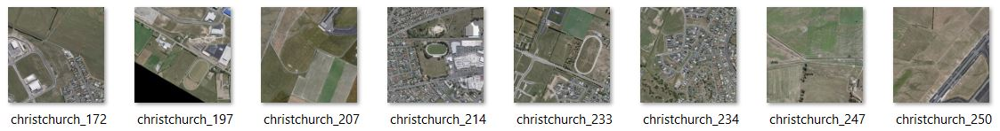
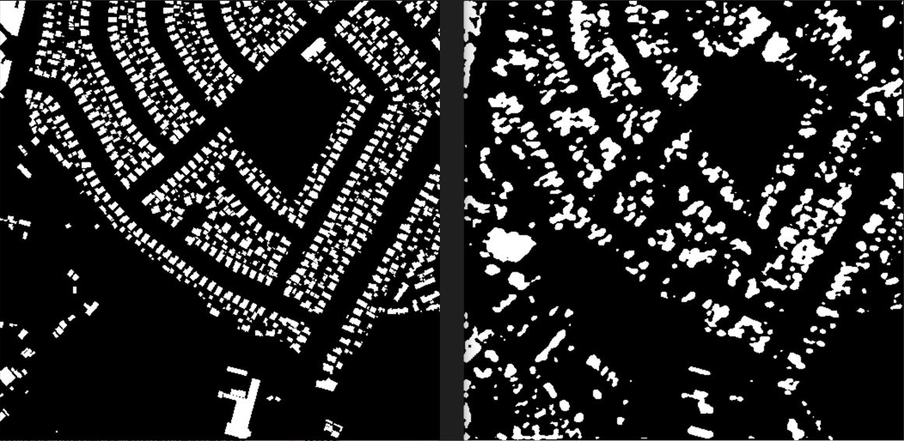

# Semantic-Segmentation-FCN-Aerial-Roof

## Project Description

The goal of this project is to train a fully convolutional network for binary image segmentation (roof, no-roof) on arial images. At the end the perfroamance of the model will be tested on the test image.

### Model architecture:

1. Input: RGB Image
2. Convolutional Layer: 3x3 kernel, 16 filters
3. Activation Layer: ReLU
4. Convolutional Layer: 5x5 kernel, 16 filters
5. Activation Layer: ReLU
6. Pooling Layer: Max Pooling
7. Convolutional Layer: 3x3 kernel, 32 filters
8. Activation Layer: ReLU
9. Transposed Convolutional Layer (Deconvolution): 2x2 kernel, 32 filters
10. Convolutional Layer: 3x3 kernel, 16 filters
11. Output

This architecture describes a Convolutional Neural Network (CNN) with multiple convolutional layers of different kernel sizes (3x3 and 5x5), a max pooling layer for downsampling, and a transposed convolutional layer (also known as a deconvolution layer) for upsampling. The ReLU (Rectified Linear Unit) activation function is used after each convolutional layer.

## Dataset
AIRS dataset was used for this task which consists of 1046 images with 880 labeled objects belonging to 1 single class (roof).

Images in the AIRS dataset have pixel-level semantic segmentation annotations. There are 166 (16% of the total) unlabeled images (i.e. without annotations). There are 3 splits in the dataset: train (857 images), test (95 images), and val (94 images). The dataset was released in 2018 by the China University of Geosciences (Wuhan), University of Waterloo, University of Tokyo, and AtlasAI Inc.

After exploring the dataset, corrupted images were removed and test data were added to the train set. This restulted in the train set with 932 samples and validation set with 92 samples. The size of each image within this dataset is 10000x10000 pixels with 7.5 cm resolution. 



Source: [AIRS dataset](https://www.kaggle.com/datasets/atilol/aerialimageryforroofsegmentation)

## Requirements
```python
- Python 3.9+

    torch==2.1.0
    numpy==1.24.3
    PIL==10.0.1
    albumentations==1.3.1  
```

## Usage

### Training:

Run the [train.py](train.py):
```python 
python train.py
```

### Testing:

Run the [test.py](test.py):
```python 
python test.py
```

### Config:

You can configure the following parameters in the [config.py](config.py) file before training or testing:
```python
# Hyperparameters etc. for training
LEARNING_RATE = 1e-3
DEVICE = "cuda" if torch.cuda.is_available() else "cpu"
BATCH_SIZE = 16
NUM_EPOCHS = 5
NUM_WORKERS = 2
IMAGE_HEIGHT = 512  
IMAGE_WIDTH = 512
PIN_MEMORY = True
LOAD_MODEL = False
MODEL_NAME = "checkpoint.pth.tar"
TRAIN_IMG_DIR = "train/image/"
TRAIN_MASK_DIR = "train/label/"
VAL_IMG_DIR = "val/image/"
VAL_MASK_DIR = "val/label/"
VAL_PREDICTION_PATH = "val_predicted_images/"

# Testing 
TEST_IMG_DIR = "test/image/"
TEST_MASK_DIR = "test/label/"
TEST_PREDICTION_PATH = "data/test_predicted_images/"
```
## Directory Structure
- `model.py`: Contains the FCN model definition.
- `dataset.py`: Defines the AIRS dataset class.
- `metrics.py`: Implements different Loss functions.
- `utils.py`: Provides utility functions for data loading and model evaluation.
- `train.py`: Script for training the FCN model.
- `test.py`: Script for making predictions on test data.

## Methodology
An open source dataset (AIRS dataset) was found for this assignment that helped with training the FCN model. one of the major challenges was data prepration considering Hardware and processing constraints. Two options were identified including:
- Resizing input images (easier path) 
- Tiling images (more challenging task and resource consuming)

The `dataset.py` file includes both classes for dealing with normal images (before resizing) and tiled images. In this project, I chose the easier path but it is possible with some small tweaks to the `utils.py` to train a model with tiled images.

In order to help the model during training, some image augmentation techniques were used such as flip, rotate, scale, resize, etc.

If you have more questions, I would be happy to answer them during the interview.

## Results
The model was trained for 16 epochs and the results are as follows:

- Dice loss for train data: 0.45
- Dice loss for test data: 0.28



Overfitting can be identified considering the difference between the performance of the model on train vs test data. This is due to a couple of reasons:
- Simplicity of the model architecture,
- Downsampling the resolution of train images (i.e., loss of information),
- lack of computational resources and in result a few number of experimentations.


## Contact Information
- Kasra Azizbaigi
- kasra.azizbaigi@gmil.com